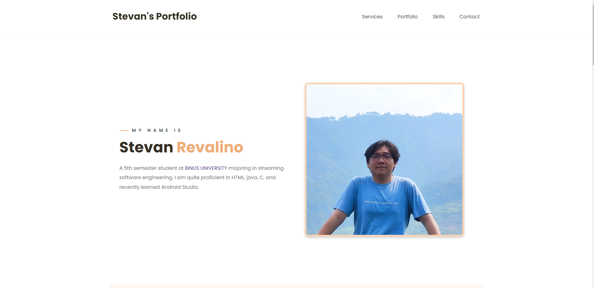

# Personal Portfolio

> https://yamizen24.github.io/StevanRevalino_Portfolio/

### Website Preview

 
  <kbd>
    
  </kbd>

## Sections 📚
✔️ About me\
✔️ Specializations\
✔️ Projects \
✔️ Skills \
✔️ Contact Info\

## Tools Used 🛠️
* [<b>VS Codes</b>](https://code.visualstudio.com/) - To make my static website (HTML, CSS, JS).
* [<b>GitHub Pages</b>](https://create-react-app.dev/docs/deployment/#github-pages) - To host the website.
