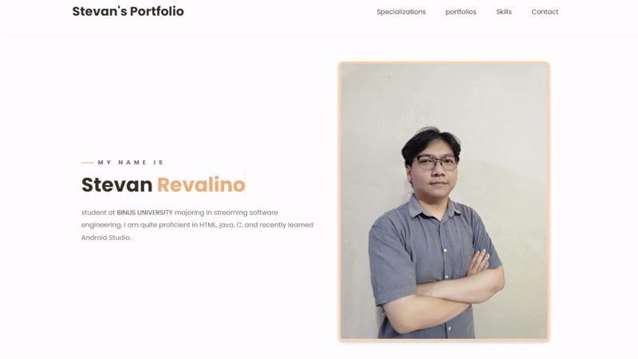

### Hello My name is Stevan Revalino from Binus University 👋

# Personal Portfolio

> https://stevanrevalino.github.io/StevanRevalino_Portfolio \
> \
> https://drive.google.com/drive/folders/1Z1mq6y1FOlS96prdZaY62i7LD1OX2gAD?usp=drive_link (All Project)

### Website Preview

 
  <kbd>
    
  </kbd>

## Sections 📚
✔️ About me\
✔️ Specializations\
✔️ Projects\
✔️ Skills\
✔️ Contact Info

## Tools Used 🛠️
* [<b>VS Codes</b>](https://code.visualstudio.com/) - To make my static website (HTML, CSS, JS).
* [<b>GitHub Pages</b>](https://create-react-app.dev/docs/deployment/#github-pages) - To host the website.
